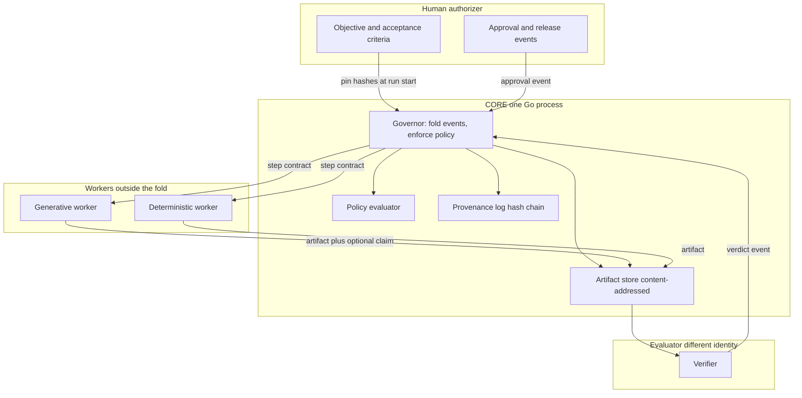

# Architecture

Tamvori turns an objective into a verified outcome. Generative workers propose artifacts. Deterministic code decides what happens next. A worker cannot accept its own output. Media production is the first proving workload and is not part of this kernel.

This document is the architecture freeze for EXP-001A. It does not specify packages, types, or APIs to implement yet. [NEXT_EXPERIMENT.md](NEXT_EXPERIMENT.md) is the first implementation proposal.

## Why these eight concepts

Fewer nouns were tried and rejected when a required rule had nowhere to live. More nouns were tried and collapsed when they were roles of an artifact, a verdict, or a policy field.

| Concept | Why it exists |
| --- | --- |
| Objective | Names the outcome a human wants and pins the acceptance criteria. Without it, "done" is whatever the worker says. |
| Run | One attempt under one pinned objective, criteria hash, and policy hash. Identity for budgets, provenance, and resume. |
| Step | The unit that can be scheduled, budgeted, retried, and verified. A run is too coarse to retry. A tool call is too fine and leaks worker internals into the governor. |
| Worker | The bounded executor. Exists so the governor can treat generative programs, deterministic programs, and humans-as-approvers through contracts instead of special cases. Humans who only approve are authorizers, not workers. |
| Artifact | The bytes a step produced, identified by hash. Plans, evidence, measurements, and proposals are artifacts. A separate type for each would recreate a framework. |
| Verdict | The independent record that an artifact met or failed a pinned criteria hash. Exists so acceptance cannot hide inside the artifact or the worker's claim. |
| Policy | The deterministic rules for transitions, budgets, retries, who may approve, and which verdicts are required. Exists so those rules are data the governor evaluates, not prose a model is asked to follow. |
| Provenance | The append-only hash-chained log of events. Exists because the run's status must be recomputable and tamper-evident. It is not a debug log. |

### Collapsed on purpose

| Candidate | Where it went |
| --- | --- |
| Plan | Artifact with schema `plan`. Once an authorizer accepts it, the run pins that artifact hash. The plan does not become a second control plane. |
| Workflow | The step list and dependencies inside a run. A reusable template library is future, not required to execute one run. |
| Tool | A capability inside a worker. The governor addresses workers, not tools. This blocks a node-per-vendor core. |
| Evidence | Artifact role. A verdict may cite evidence artifact hashes. |
| Budget | Fields of policy, counted on the run, enforced by the governor. |
| Approval | A verdict whose authority is a human authorizer. |
| Outcome | A measurement artifact plus the run's terminal projection (`accepted`, `rejected`, `halted`). |
| Improvement proposal | Artifact with schema `proposal`, executed as its own run. Same verdict rules. See [CONTINUOUS_IMPROVEMENT.md](CONTINUOUS_IMPROVEMENT.md). |

Eight is the core concept count a new developer must understand before reading an adapter.

## Authorities

Four authorities, enforced by the governor. Detail in [INVENT.md](INVENT.md).

- Proposer creates proposal artifacts.
- Executor creates output artifacts.
- Evaluator creates verdicts.
- Authorizer creates approvals, releases, and criteria versions.

The executor of an artifact cannot be the evaluator of that artifact. The governor checks identities on every verdict event and refuses the event on a match.

## Run projection

A pure function folds the log into a projection. Workers do not call this function.

```text
drafted
  -> plan_pinned          (plan artifact hashed, authorizer accepted it or policy says no approval is required)
  -> executing
  -> awaiting_verdict     (step output recorded, verdict not yet present)
  -> awaiting_approval    (only if policy requires a human for this step or for release)
  -> accepted | rejected | halted
```

Step projection, nested inside the run:

```text
pending -> running -> output_recorded -> verdict_recorded -> passed
                                                  \-> failed -> retrying | halted
```

`halted` includes budget exhaustion, denied identity, and operator cancel. `rejected` means a required verdict failed and retries are exhausted or not allowed.

Release is not implied by `accepted` when policy separates them. `accepted` means criteria passed. `released` is a later event if the adapter has an external side effect.

## Component map



The governor never imports a domain SDK. Workers never write the log. They return bytes to the governor, which appends the event.

### CORE

Required for the first implementation slice:

- Objective pin (criteria hash, policy hash)
- Run and step projection
- Worker invocation contract
- Content-addressed artifact store on the local filesystem
- Hash-chained provenance log
- Policy evaluator for transition, retry count, byte size, and time
- Identity check that producer and evaluator differ
- One generative-shaped worker and one deterministic worker
- One independent verifier

The generative-shaped worker in the first slice may be a fixture that returns canned bytes, behind the same contract a model worker would use. That proves the boundary without a provider SDK.

### OPTIONAL

Not required to prove the kernel:

- Human approval pause (the state exists in the projection; a fixture run may use a policy that does not demand it)
- More than one verifier
- Skipping a step when input hashes already map to a verified output
- CLI beyond a single `run` command

### ADAPTER

Present only as schemas and workers for a domain. The first media adapter is a structured production package, not a picture.

Media adapter concepts, isolated from the core:

- Media production package schema (title, objective reference, asset list, hashes, intended sequence)
- Edit decision list
- Transcript or other model-legible proxy of a binary
- Shot, timeline, caption, and grade rules
- Render worker (FFmpeg or otherwise)
- Image, voice, and video model providers

Document adapter concepts, for a later direction:

- Canonical document artifact
- Proposed action artifact derived from that document
- Parser worker (an existing tool such as Docling may be invoked; it is not vendored into the core)

Software adapter concepts, later:

- Patch artifact
- Test-result artifact produced by a deterministic worker
- Repository worker

None of these names appear in the core state machine.

### FUTURE

- Reusable workflow templates
- Real model-provider workers
- FFmpeg render worker
- Browser worker
- Sandbox for untrusted code
- Multi-user identity and authentication
- Remote artifact stores
- More than one OS process for the governor
- A view or UI over the log
- Hosting the improvement loop on Tamvori's own codebase

## Go suitability

Go is advantageous for the governor. It is not advantageous for model inference, browser engines, or document-layout models. Those stay in worker programs.

| Concern | Assessment |
| --- | --- |
| Concurrency | Useful for waiting on worker subprocesses. One goroutine owns a given run's fold so state is not shared. Channels are not the data model. |
| Deterministic orchestration | Ordinary Go plus an explicit event fold. A workflow SDK would import replay constraints and a cluster mindset this design rejects. |
| Interfaces | A small set: artifact store, worker runner, clock, verdict source. Interfaces exist for tests. They are not an extension marketplace. |
| Static binary | One governor binary is the deployment. Workers may be separate programs on `PATH`. |
| Standard library | `os/exec`, `crypto/sha256`, `encoding/json`, `context`, `testing`, `net/http` if a later phase needs it. No web framework is justified. |
| Dependencies | The first implementation budget is zero third-party modules. See [COMPLEXITY_BUDGET.md](COMPLEXITY_BUDGET.md). |
| Process execution | `os/exec` with `context` deadlines is the worker boundary, including a future FFmpeg worker. |
| HTTP | Not required for the kernel. When an API exists, `net/http` is sufficient until measurements say otherwise. |
| Observability | The provenance log is the primary trace. Structured stderr may mirror it. A metrics stack is not required to start. |
| Portability | A static binary plus local files is the portability story. |
| Testing | Table tests for the fold, replay tests for a fixed log, and filesystem tests for the hash chain. Generative workers are stubbed. |
| Reproducible builds | Go module builds with a frozen toolchain are enough. No containers in the first slice. |
| Performance and memory | The governor stores hashes and small JSON events. Media bytes live as artifacts, not in RAM as a graph of frames. |
| Failure recovery | On start, read the log, verify the chain, fold, resume. In-flight unrecorded work is governed by the retry policy. |

Go would stop being the right core language if the kernel needed a Python model runtime inside the same process. That need is an adapter leak. Do not take it.

Temporal's server is evidence that Go can implement durable orchestration, and evidence that Go code can grow a cluster. Tamvori takes the language and the history lesson. It does not take the server.

## Economic hypothesis, restated as an architectural constraint

The kernel is justified only if it reduces the cost of being wrong: a release without evidence, a retry that doubles spend, a worker that quietly rewrites "done," a recovery that depends on a chat transcript. Domains where those costs are real include media production, software change, document-to-action, manufacturing, procurement, research production, and knowledge maintenance. EXP-001A does not rank them. It requires that the first media slice use only adapter schemas, so a second domain can be added as workers and schemas rather than as a fork of the governor.

## Bootstrap toward an AI-built Tamvori

The governor defined here is the same shape as the development process that should eventually build Tamvori.

1. Humans write objectives and acceptance criteria for each phase.
2. An AI developer may propose and write code.
3. Tests and complexity checks the AI is not allowed to edit decide the verdict.
4. A human authorizes architectural changes and criteria changes.
5. Later, Tamvori can run that loop on itself: a proposal artifact, a candidate run, a comparison to baseline, a verdict.

EXP-001A does not build that loop. [NEXT_EXPERIMENT.md](NEXT_EXPERIMENT.md) is the smallest run that makes the kernel real. Until that kernel exists, the "deterministic governance" of Tamvori's own development is the human plus the phase's written acceptance criteria.

## Uncertainties

- A fixture generative worker proves the contract and does not prove that a real model will respect output schemas. Schema failure must be a recorded worker failure, which the kernel can test with a fixture that emits bad bytes.
- Local hash chains detect tampering after the fact. They do not stop a privileged user from rewriting files and regenerating hashes unless the chain is anchored outside the machine. External anchoring is future work, not a reason to add a service now.
- Identity is a string in a local policy file until real authentication exists. The separation rule is still testable: two distinct names, compared by the governor.
- Whether eight concepts remain enough after the second domain is an explicit question for the phase that adds that domain. The budget says the core concept count does not rise without a recorded human decision.
